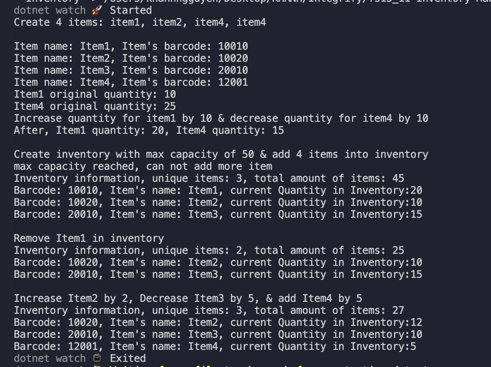

# Inventory Management
In this assignment, you will create a simple inventory management system which allows users to add, remove, and view items in the inventory.

## Requirements

Create class `Item`, which has barcode, name and quantity, which are private. Each item should have unique barcode, and quantity can not be negative. Provide the following methods:
1. Method `IncreaseQuantity` that takes an integer parameter, and increase the amount of item in the inventory.
2. Method `DecreaseQuantity` that takes an integer parameter, and decrease the amount of item in the inventory.
3. Methods to get name, quantity, barcode.

Create class `Inventory`, which can have only 1 instance, with the following properties and methods:
1. `items`: stores the inventory items and their quantity. Each item can only appear once in the inventory.
`maxCapacity`: stores the maximum total amount of items that can be stored in the inventory.
2. A constructor that takes an integer value as the maximum capacity of the inventory and initializes the items.
Use access modifiers to protect the `items` and `maxCapacity` property from direct external modifications.
3. Method `AddItem` that takes two parameters (item and item quantity) and adds the item to the inventory. If the inventory reaches `maxCapacity`, the method should return false. Otherwise, it should add or replace the item in `items`.
4. Method `RemoveItem` that takes a string parameter (item barcode) and removes the item from the inventory. If the item does not exist in the inventory, the method should return false. Otherwise, it should remove the item from items and return true.
5. Method `IncreaseQuantity` that takes an integer parameter and a string parameter (item barcode), and increase the amount of item in the inventory.
6. Method `DecreaseQuantity` that takes an integer parameter and a string parameter (item barcode), and decrease the amount of item in the inventory.
7. Method called `ViewInventory` that prints the items (barcode, name, quantity) in the inventory to the console.
8. A destructor that prints a message to the console when the inventory is destroyed.

Create a class called "Printer" with 2 methods:
1. `PrintItem` takes 1 parameter of type `Item` and prints out information of a single item with name and barcode
2. `PrintInventory` takes 1 parameter of type `Inventory` and prints out information of the inventory with the amount of unique items and total number of items.

Use good naming convention and access modifier for class, properties, and methods.

## Result
